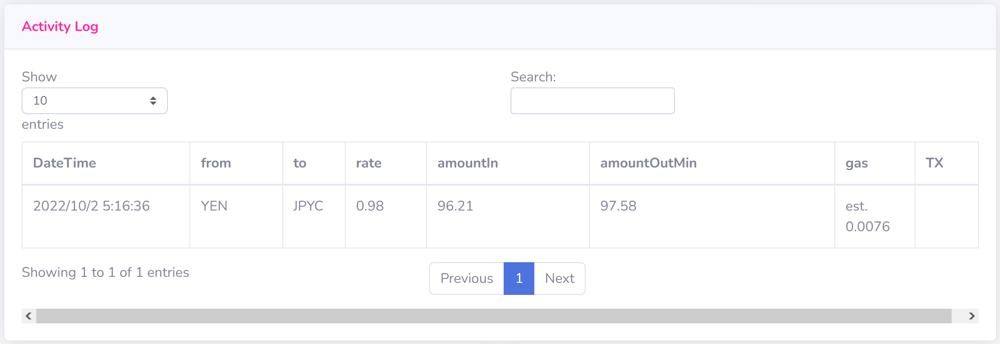

# YENstabilizer

hosted on [https://universay.github.io/YENs/](https://universay.github.io/YENs/)

## [Yen Coin (YEN)](https://info.quickswap.exchange/#/token/0xa874a3082d232e517654da2ce89374d556d339c4)

## JPYCstabilizer

hosted on [https://nuko973663.github.io/JPYCstabilizer/](https://nuko973663.github.io/JPYCstabilizer/)

see article on hide.ac [https://hide.ac/articles/ZZoaKG4yb](https://hide.ac/articles/ZZoaKG4yb)

## エンエン

エンエンエンエンエン

## to do

TXが実行されないエン。途中で止まるエン。

だれか直してほしいエン。[Twitter](https://twitter.com/babyunibabu)

- dark mode の実装
- ウォレットアドレスの非表示オプション
- スタビの APR 表示
- 流動性プールの APR 表示
- 中間レートだけでなく、実スワップレートも取ってくる

## update log

### [v.20221001.0]()
